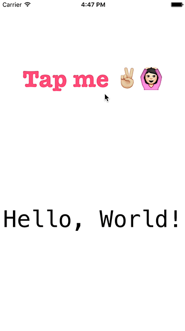
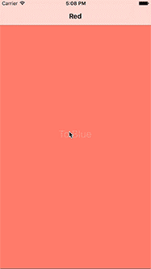
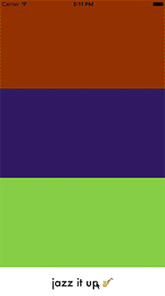

# iOS Development 101 Workshop @ ITP Camp 2016

All supplementary workshop materials and links can be found here: [Presentation Slides](https://docs.google.com/presentation/d/1opGp7YcJ4mtu2ecTsYQ7ZrauK6zdvg9qrXpKJdV2WZ0/edit?usp=sharing
)

Alternatively, refer to this readme for a slightly more boring presentation.

## PREREQUISITES
* Have a computer running OSX/macOS 
* Have Xcode (between 7.1 - 7.3)
* Have an Apple Developer account - [how to set it up](http://www.idownloadblog.com/2015/12/24/how-to-create-a-free-apple-developer-account-xcode/)

## PLAN
* Familiarize with the IDE
* Create a basic “Hello, world” app
* Create something a little more interesting
* Resources, best practices, how to continue learning on your own

## HELLO, WORLD
* The first app we'll be making is a simple Hello, World app

## NAVIGATION
* We'll learn about how easy it is to create an app with basic navigation
* Open the Starter project and build up until it looks like the Final

## RANDOM COLORS
* We'll learn about how easy it is to add some touch gestures (swipes) and iPhone sensors (shaking)
* Open the Starter project and build up until it looks like the Final

